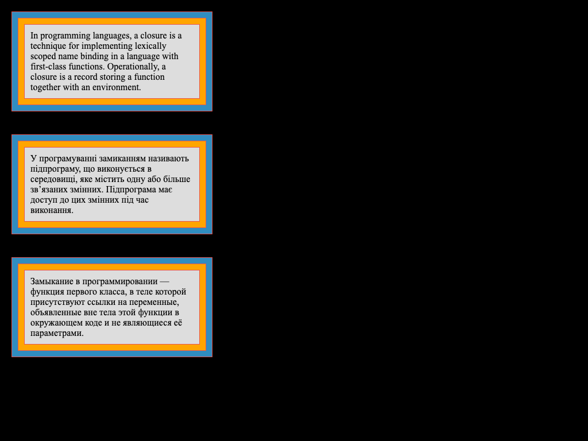

# Enclosures
1. Replace `<your_account>` with your Github username in the links
    - [DEMO LINK](https://ztx25.github.io/layout_enclosures/)  
    - [TEST REPORT LINK](https://ztx25.github.io/layout_enclosures/report/html_report/)
2. Follow [this instructions](https://mate-academy.github.io/layout_task-guideline/)
___

## The task
Add 3 block as shown here 
Use this extension for Chrome to find out the right color [ColorZilla](https://chrome.google.com/webstore/detail/colorzilla/bhlhnicpbhignbdhedgjhgdocnmhomnp?hl=en)
* [IMPORTANT] Add an attribute `id="qa-block"` to the block with english text.

* The width of each box is 350px (including all borders).
* You can find the exact values of colors by using an image editor program.
* The width of the redish border must be 1 pixel.
* The width of the bluish and yellowish borders must be 10 pixels (they, however, 
do not have to literally be borders of any HTML container).
* The space around the text must also be 10 pixels.
* The distance between the boxes and the edges of the page must be 20 pixels.
* The distance between the boxes themselves must be 40 pixels.

The text content in three languages follows:

> In programming languages, a closure is a technique for implementing lexically 
scoped name binding in a language with first-class functions. Operationally, a 
closure is a record storing a function together with an environment.

> У програмуванні замиканням називають підпрограму, що виконується в середовищі, 
яке містить одну або більше зв’язаних змінних. Підпрограма має доступ до цих 
змінних під час виконання.

> Замыкание в программировании — функция первого класса, в теле которой 
присутствуют ссылки на переменные, объявленные вне тела этой функции в 
окружающем коде и не являющиеся её параметрами. 
